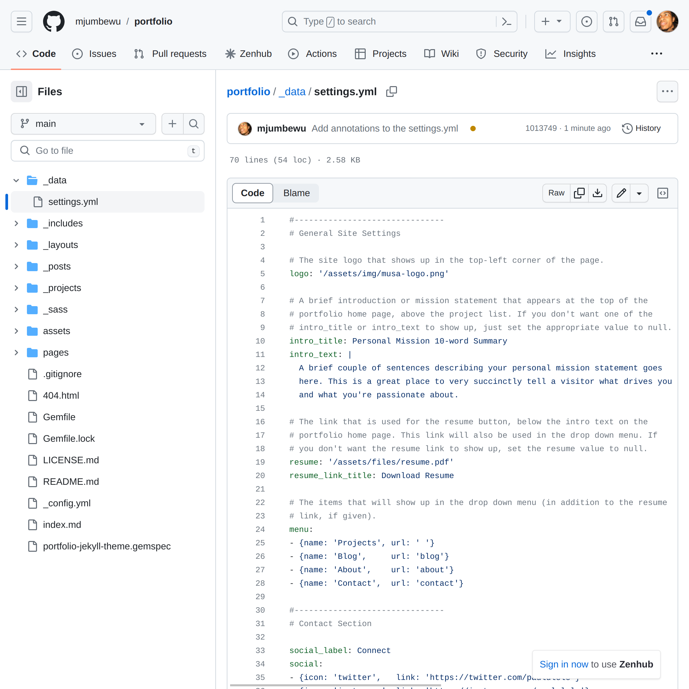

# MUSA GitHub Workshop
_Using `git` and GitHub for your projects and portfolio_

---

## Imagine this scenario...

<!-- This pattern is based very roughly on a real project I worked on recently, though the specifics have been changed. -->


I'm working on a model for dynamic parking pricing for OTIS in Philadelphia.

<!-- I have examples of prior art from other cities, but I want to make sure that my model is as accurate as possible for the context of Philadelphia. This means I'm going to have to try out a few models, get feedback from my colleagues, and iterate on my work.-->

<!-- Let's say I'm working in R and I put together a first pass in a file named dynamic_pricing. This is entirely reasonable. -->
* dynamic_pricing.r
<!-- Now I run the model by some of my colleagues and they give me some other ideas that might improve the model, but might not. I want to test it so I create a copy of my file called dynamic_pricing_revised. This is the beginning of my trouble. -->
* dynamic_pricing_revised.r
<!-- That same process happens again and I end up with a revision of my revision, dynamic_pricing_revised_2, since I don't want to lose my previous versions, just in case. -->
* dynamic_pricing_revised_2.r
<!-- Finally, I'm ready to share my work with a wider presentation to stakeholders. -->
* dynamic_pricing_final.r

<!-- This is a pretty common pattern, and it's a mess. Someone coming to the code base 3 months in the future isn't going to know which files are necessary to keep around, and which are just clutter. We can do better, and in this workshop we're going to talk about how. -->

---

## Goals

**Outcome**: You will leave here with a portfolio site hosted on GitHub Pages that you'll be able to add entries to as you complete projects in the MUSA program.

**Purpose**: To introduce you to the concept of version control, and to give you a basic understanding of why and how to use version control &mdash; specifically a version control system called `git`, along with the website GitHub.

<!--
_This workshop is in line with the following MUSA program learning outcomes:_
- _Exercise professional skills and be well-equipped to enter the current workforce._
- _Be able to work collaboratively and cooperatively with peers and stakeholders._
-->

---

## Agenda

0.  Intro &mdash; setting the stage (5 min)
1.  What is a VCS? What is `git`? What is GitHub?
2.  Getting started with GitHub
    - Signing up for an account
    - Creating your portfolio
3. Customizing your portfolio
    - Adding projects with Markdown
    - Modifying the configuration with YAML
    - Peeling back the curtain &mdash; how's it work?
4. Using `git`
    - Installing a `git` client
    - Cloning, updating, committing, pulling, pushing

---

## What is a version control system?

<!-- git is a version control system, but what's that? -->

The purpose of a *version control system* (**VCS** -- also called a *source code manager* or **SCM**) is to make it easier to manage and organize changes in your code. It allows you to track changes to files, quickly compare different versions of files, and to revert to previous versions or sync new changes into those files.

**Version control is a time-travel enabling super-power 🦸🏾‍♀️!**

---

## Direct benefits of version control

- **Tracking changes:** A VCS monitors the changes you make to your code. Instead of saving new versions of your files like "script_final," "script_final_revised," and so on (which we've all done 😒), a VCS keeps a detailed record of each change, and allows you to add annotations to your changes like "added an introduction," "changed the main function's name," and so forth.
- **Collaboration:** If you're working with colleagues on the same code or sharing your code with others, a VCS helps everyone stay on the same page. It ensures that everyone can work on the code at the same time without messing things up. It's akin to working with others in the same Google Doc, rather than emailing around different versions of a Word document.

---

## ... and a few indirect benefits of version control

- **Backup:** It's like a safety net. If you accidentally delete something important or your code becomes a big mess, you can go back to a previous version.

- **Experimentation:** Want to try a new idea without destroying your current work? A VCS lets you create a new "branch" to experiment without affecting the main code.

- **Documentation:** It's a log of your coding journey. You can see why you made certain changes, which can be really helpful when you revisit your code later.

---

## Why git, and why GitHub?

There are other VC systems -- `svn`, `hg`, even some niche ones (like Piper, which Google uses internally). Is `git` the best VCS? That's debatable, and a matter of opinion.

But it's definitely the most popular by far.

<!--
The first version of git was released in 2005.

In 2009, most of the projects that I was working on were tracked in Subversion. One was tracked in Mercurial and one in CVS.

By 2014, all of the projects that I was working on were tracked in Git.

-->

---

## Why is `git` the most popular VCS?

<!-- Is this true? I don't have a statistic to back it up, and there are many metrics that you could possibly use, but based on what I've seen in tech writ large, git is the most popular VCS. Even if it's a plurality, I'm fairly certain there's no VCS more popular than git today. 

[back to the slide]

-->

When git debuted it had several things going for it:
* **It was invented by Linus Torvalds**, the inventor of Linux. There's not much stronger star power you could have for a tool that developers use.
* **Merging became magic ✨**. `git` was -- and is -- really smart about merging code changes from different collaborators together.
  
  <!-- 
  
  [merging became magic...]
  
  In time, many of you will come to have complex feelings toward merging code -- among those feelings will be anxiety, anger, perhaps fear. However, you have to understand that it used to be so much worse. -->
  
  `git` handles most merge situations seamlessly. ... But so do other tools that were invented around the same time (like `hg` or `bzr`). So the questions remains: why `git`?

I think the thing that pushed `git` over the top was...

---

## GitHub

<!-- GitHub was launched in 2008, 3 years after the first release of git. It wasn't the only site where you could share your code and it's still not. -->

- Launched in 2008.
- It created tools for the social aspects of collaboration (managing code change permissions, requesting code merges), ensuring strong network effects, while relying on git for the technical aspects.
- It stayed ahead of its competition (like BitBucket) by adding features that developers wanted (like GitHub Pages, which we'll use today), and by more effective corporate strategy, gaining favor among both open source and startup communities.
- Bought by Microsoft in 2018

---

### Sample GitHub version history


---

# Getting started with GitHub

---

## Sign up for a GitHub account

<!--
Generally, to use git and GitHub you want to have a GitHub account _and_ a program on your computer that connects to GitHub (called a git client). You can use GitHub without a local git client, just by making changes directly on the GitHub website, and for some changes this is a reasonable thing to do. Very often it is not, but we'll get to that later.

[back to the slides]
-->


Take a few minutes to do this now ⏲️.

_(Use your personal or Penn email address -- you can add more than one address later)_

---

# Setting up the portfolio website

<!-- I recommend everyone follow along on their own GitHub accounts. If you get lost, these slides are available, but we'll also have another opportunity to take a break or catch up later. -->

---

## Make a copy of the portfolio template repository


1.  Navigate to https://www.github.com/mjumbewu/musa-portfolio-template
2.  Click the "Use this template" button to create a new repository based on this template.

<!-- I created a repository that you can use as a template for your portfolio. I actually created this repository based on someone else's work. I recommand taking a read through the information contained in the README file.

When you click "Use this template, this is going to take the folders and files in this **repository** and copy them into a new repository that you own.

This may be the first time that I introduced the word "repository". It's a very central concept in GitHub, git, and version control in general. -->

---

## Vocabulary (a quick aside...)

- **Repository:** A repository (or "repo") is a collection of files and folders that you've told `git` to keep track of. You may have many repositories in your GitHub account.
- **Fork**: Other people can copy a repository from your account to their account; this process is called "forking".
<!--
- **Clone**: You can also copy a repository from your account or someone elses account to your computer; this process is called "cloning".
- **Push** / **Pull**: Git helps you keep various copies of repositories synchronized by "pushing" your changes into other copies or "pulling" other people's changes into yours.
-->

---

## You've forked the repository!


If you refresh you should see the same files as before, but under your account.

---

## You can browse the files...

...but we can do better.


<!-- Technically, at this point anyone could access the content in this portfolio website (assuming you made the repository "Public") by just browsing to the appropriate folders and files. Each one of the individual project pages in this site is represented by a Markdown file; we'll talk about Markdown a little later, but I also know that you'll cover it in more deptch at some point in 508.

Browsing files like this certainly isn't the most engaging way to see the information, but GitHub has a feature called GitHub Pages that will allow us to automatically build these Markdown files into a website. -->

---

## Open the GitHub Pages settings


<!-- To get to the pages settings, first open the repository settings with the Settings button which should be in the top-right of your repo links. -->

---

## Open the GitHub Pages settings


<!-- Then, over on the left side you should see an option labeled "Pages". -->

---

## Configure the GitHub Pages site


Select the deployment branch and click **Save**.

<!-- The only setting we'll have to configure is to select the "branch" that GitHub Pages will use. In a git repository you can have several "branches", each of which has a slightly different version of your website. You can them "merge" one branch into another. This can be useful in this case, for example, if you wanted to upload a draft of a post to your repository, but don't want to publish it on your live site yet.

Right now, there should only be one branch in your repo -- called "main". Select that branch and click the "Save" button. -->

---

## In a couple minutes, your site will be ready!


You can keep refreshing the settings page to see when it's done.

<!-- When your site is done being built you'll be able to see the URL for the site up at the top as in this image. For mine I have a custom URL set. You can too, but we're not going to into how to set that up today. There will be a link where you can read more about that in the **Additional Resources** section.

The reason that the site isn't _immediately_ available or updated is because GitHub has to do some work to prepare the site for you. You can actually see the work that it does in your repository's **Actions**. -->

---

Your URL will be of the form: `https://[USERNAME].github.io/[REPO_NAME]/`

e.g. [https://**mjumbewu**.github.io/**portfolio**/](https://mjumbewu.github.io/portfolio/)

---


A new portfolio is now available at your URL (but you haven't _really_ made it yours yet).

---

# Customizing your portfolio

---

## Updating your projects

- Project pages (and blog pages, if you choose to use them) are written in **Markdown**.
- Markdown is a _simple_ formatting language for text, used to style and structure content, often (but not exclusively) for the web.

---

Consider the following project page...


<!-- This is the page that you come to if you click on the "Project 1" link from the home page. -->

---

The content of the page is written in Markdown. We can find the code if we browse to the file _proj-1.md_ in the repository and click on the "Edit this file" button (the pencil icon).


<!-- Note that there's nothing special about that file name. In fact, when you're adding actual projects, I'd encourage you to use sensible, relevant file names. The main guidance I'd give about file names for markdown files is that you should stick to lowercase letters, numbers, dashes, and underscores -- this is mainly by convention. -->

**Note:** Markdown file names generally contain only lowercase letters, numbers, dashes (`-`), and underscores (`_`), and end in _.md_.

---

This is what the Markdown code looks like.


<!-- Let's take a tour -->

---

## Markdown basics

The first part of the file is called the **front matter**. It's written in **YAML**. The start and end of the front-matter secton is indicated by the `---` characters.

```md
---
layout: post
title: 'Project One'
thumbnail: /assets/img/projects/proj-1/thumbnail.jpg
---
```

<!-- We'll come back to YAML, as there are a number of other settings for our site that are also written in YAML. -->

The front-matter section describes metadata about the page -- things that may or may not show up directly on the page, but are important for the site to know about.

---

## Markdown basics

Below the front-matter section is the content of the page, written in Markdown. Here's an example of some Markdown code:

```md

### Markdown example

With Markdown you can do things like **bold** and
_italicize_ text, create [links](https://www.google.com),
and add images.
```

It looks like this when rendered:

> ### Markdown example
>
> With Markdown you can do things like **bold** and *italicize* text, create [links](https://www.google.com), and add images.

<!-- There are a couple links to syntax guides for Markdown in the "Additional Resources" section. -->

---

## Markdown basics

If you want to add an image, you can do so by adding an image tag like this:

```md

```

You can upload additional images into the _assets/img/_ folder and reference them in your Markdown file.

<!-- For the sake of organization, I recommend placing all images relevant to a particular project page under an assets/img/projects/proj-name/ folder. -->

---

## Try it out!

Take a few minutes ⏲️ to try the following:

1.  Find the _\_pages/about.md_ file in your repository.
2.  Click the "Edit this file" button (the pencil icon).
3.  Make changes to the file (anything -- you can always change it later!).
4.  Click the "Commit changes" button at the bottom of the page.
5.  **Write a good commit message**.
6.  Commit directly to the `main` branch.
7.  Reload the About page on your portfilio site.

<!-- A good commit message doesn't have to be long, but it should describe the change that you made, and ideally why you made it. These messages will create a comprehensive log for you and others in the future. -->

---

## Site-wide settings

- Other site content and settings is stored in the files _\_config.yml_ and _data/settings.yml_. These files are written in **YAML**.
- YAML (YAML Ain't Markup Language) is a human-readable data serialization format. It's often used to configure settings or data structures in a more readable way than traditional programming languages.

---

Find the _data/settings.yml_ file in your repository. This is what YAML looks like.



---

## YAML Basics

YAML files are made up of **key-value pairs**. Each **key** is the name of a particular piece of data for the site, and the **value** is what will be used when the key is referenced.

For example:

```yml
# Site header logo
logo: '/assets/img/musa-logo.png'

# Site menu entries
menu:
- {name: 'Projects', url: ' '}
- {name: 'Blog',     url: 'blog'}
- {name: 'About',    url: 'about'}
- {name: 'Contact',  url: 'contact'}
```

<!-- Values can have different types. They can be strings, numbers, booleans, lists, objects, or null. You can find more about YAML in the Additional Rsources section.

For now, you don't have to know the mechanics of how these values actually get used in the page, you'll just have to know where to set them. -->

---

# Using `git` _outside_ of GitHub

---

## Installing a `git` client

There are many options for `git` clients. I recommend [GitHub Desktop](https://desktop.github.com/), which is available for Mac and Windows.

You can also use a client that's integrated into your code editor. For example, [VS Code](https://code.visualstudio.com/) has a built-in `git` client.

Finally, you can use the command line. This is the most powerful option, but it's also the most difficult to learn. If you're interested in learning more about this, I recommend [this tutorial](https://www.atlassian.com/git/tutorials/learn-git-with-bitbucket-cloud).

<hr>

[1] https://desktop.github.com/
    
[2] https://code.visualstudio.com/

---

## Clone your repository


---

## Where is your code?

- Your `git` client will download a copy of your repository to your computer. This is called "cloning" the repository. By default, it will be saved in a folder called "GitHub" in your home directory.

---

## Update, commit, push!

1.  Make changes to your local files
2.  Commit those changes to your repository
3.  Push those changes to GitHub

---

## ... but sometimes there may be conflicts!

<!-- conflicts happen when git doesn't know what action should be taken. -->

1.  Modify the _/data/settings.md_ file on GitHub:
    ```yml
    intro_title: My Personal Mission 10-word Summary
    ```
    Commit that change.
2.  Modify the _/data/settings.md_ file on your computer:
    ```yml
    intro_title: The Personal Mission 10-word Summary
    ```
    Commit that change.
3.  Try to push your changes to GitHub.

---

## Conflicts can be resolved!

... but it's a different process in each client.

---

# Additional Resources

---

## Set a custom domain for your site

See https://docs.github.com/en/pages/configuring-a-custom-domain-for-your-github-pages-site

---

## Learn more about Markdown syntax

- Markdown Basics from Daring Fireball: https://daringfireball.net/projects/markdown/basics
- Markdown Basics from GitHub: https://docs.github.com/en/get-started/writing-on-github/getting-started-with-writing-and-formatting-on-github/basic-writing-and-formatting-syntax

---

## How (and why) to write good commit messages

From FreeCodeCamp: https://www.freecodecamp.org/news/how-to-write-better-git-commit-messages/

---

## Learn more about YAML

Decent YAML Basics from Tutorials Point: https://www.tutorialspoint.com/yaml/yaml_basics.htm

---

## Sample GH Pages themes

- [Forty](https://jekyllthemes.io/theme/forty-jekyll-theme)
- [Freelancer](https://jekyllthemes.io/theme/freelancer-theme)
- [Millennial](https://jekyllthemes.io/theme/millennial)
- Other [free themes](https://jekyllthemes.io/free) and [awesome themes](https://github.com/planetjekyll/awesome-jekyll-themes)

---

# Common actions:
- Fork a repository
- Clone a repository
- Create a branch
- Make and stage changes
- Commit changes
- Push changes
- Submit a pull request
- Merge a pull request
- Checkout a branch

---

## Collaboration recommendations

1.  When working on the same code base, work on different components
    - Ideally those components are in different files
    - If they're in the same file, work on different parts of the file
2.  When merge conflicts arise, rely on your tools
    - Merge conflicts will happen. Take a deep breath, follow the instructions in your `git` client, and resolve them carefully.
3.  Commit and sync (push/pull) your code frequently
    - This will help you avoid merge conflicts, or at least allow you to resolve them before they become too complicated
